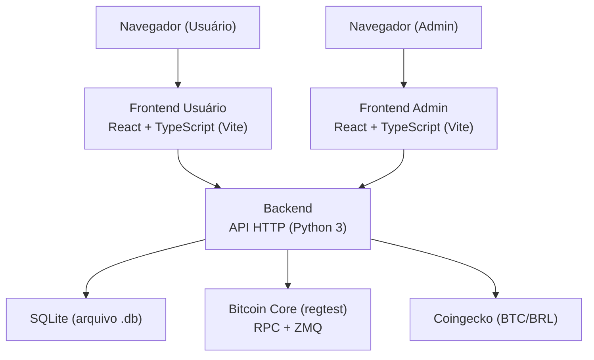
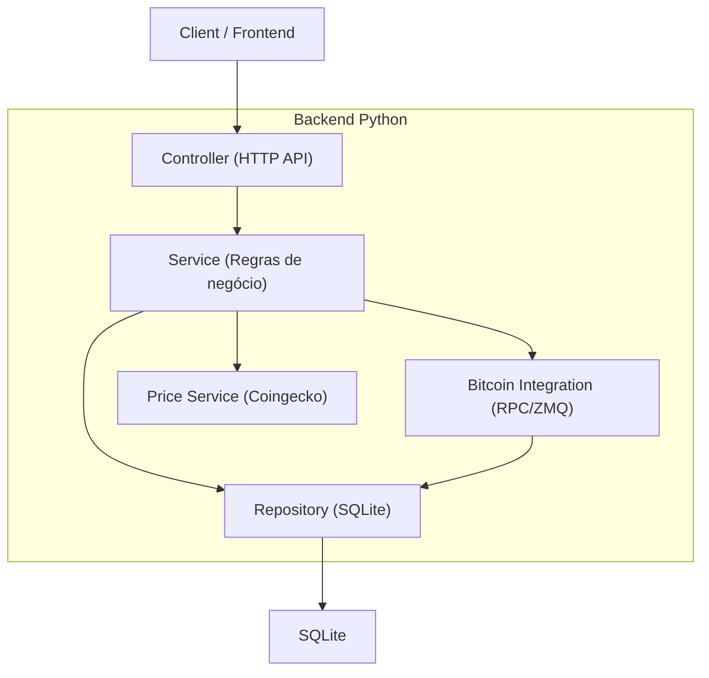
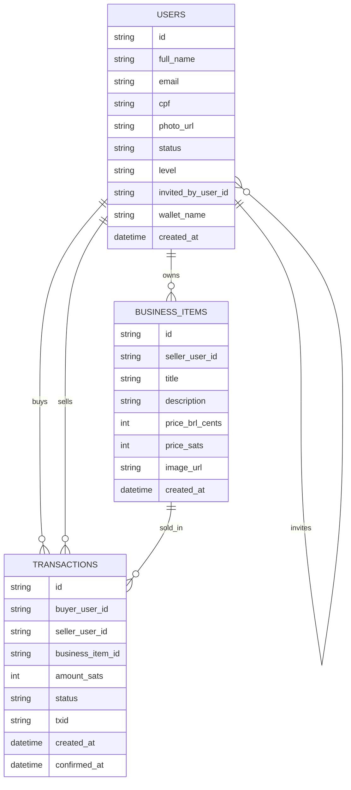

## 1. Visão geral (arquitetura simplificada)

Este MVP tem **3 componentes** e roda **100% dentro de uma VM Lubuntu 26.04 LTS** (ambiente **somente DEV**):

* **Frontend do usuário** (Web)

* **Frontend do administrador** (Web)

* **Backend** (API)

Tudo fica na mesma VM para reduzir variáveis e facilitar debug.



## 2. Tecnologias (MVP)

* Frontends (usuário e admin): **React JS + TypeScript** (empacotamento com **Vite**)

* Backend: Python 3 (API HTTP + integração Bitcoin via RPC/ZMQ)

* Database: SQLite

* Integrações: Bitcoin Core (RPC + ZMQ, rede regtest) + Coingecko (BTC/BRL)

## 2.1 Autenticação (MVP)

* Usuário: login com **e-mail + senha**.
* Admin: login com **usuário + senha**.
* Backend armazena **somente hash** de senha (nunca senha em texto puro).
* Sessão: token assinado (JWT) em cookie `HttpOnly`.

* Bootstrap do admin: no primeiro start, se `admin_users` estiver vazio, criar o usuário `ADMIN_USERNAME` com `ADMIN_PASSWORD_HASH`.

## 3.Route definitions

| Route                 | Purpose                                                    |
| --------------------- | ---------------------------------------------------------- |
| /onboarding/\[invite] | Cadastro via link de convite + status aguardando aprovação |
| /catalogo             | Catálogo (read-only para ⭐)                                |
| /negocio/\[id]        | Detalhe do item + checkout/confirmar pagamento             |
| /buscar               | Busca na rede (vendedores + “convidado por…”)              |
| /perfil               | Perfil + reputação + histórico                             |
| /meus-negocios        | Cadastro e gestão de itens (vendedor)                      |
| /notificacoes         | Aprovação de convidados (anfitrião)                        |
| /admin                | Portal Admin (árvore de convites, alertas, suspensão)      |
| /login                | Login (Usuário)                                            |
| /admin/login          | Login (Admin)                                              |

## 4.API definitions (If it includes backend services)

### 4.1 Tipos centrais (TypeScript compartilháveis)

```ts
export type UserLevel = "STAR_1" | "STAR_2" | "STAR_3" | "STAR_4";
export type UserStatus = "PENDING_APPROVAL" | "APPROVED" | "SUSPENDED";

export type User = {
  id: string;
  fullName: string;
  email: string;
  cpf: string;
  photoUrl: string;
  status: UserStatus;
  level: UserLevel;
  invitedByUserId: string | null;
  walletName: string; // derivado de CPF+nome (regra do doc)
  createdAt: string;
};

export type BusinessItem = {
  id: string;
  sellerUserId: string;
  title: string; // <= 50
  description: string; // <= 200
  priceBrlCents: number;
  priceSats: number;
  imageUrl?: string;
  createdAt: string;
};

export type TxStatus = "CREATED" | "BROADCAST" | "CONFIRMED" | "CANCELED";
export type Transaction = {
  id: string;
  buyerUserId: string;
  sellerUserId: string;
  businessItemId: string;
  amountSats: number;
  status: TxStatus;
  txid?: string;
  createdAt: string;
  confirmedAt?: string;
};
```

### 4.2 Endpoints mínimos (alto nível)

* POST /api/onboarding/finish (cria usuário + cria wallet via RPC e só confirma após sucesso)

* POST /api/auth/login (usuário: e-mail + senha)

* POST /api/auth/logout

* GET /api/auth/me

* POST /api/host/approve (aprova/recusa convidado)

* GET /api/catalog/items (lista itens)

* POST /api/items (publica item; calcula sats via preço BTC/BRL)

* POST /api/checkout/confirm (envia tx via RPC; inicia espera de confirmação via ZMQ)

* GET /api/profile (reputação + histórico)

* GET /api/admin/invite-graph (árvore/grafo + alertas)

* POST /api/admin/suspend (suspensão preventiva)

* POST /api/admin/auth/login (admin: usuário + senha)

* POST /api/admin/auth/logout

## 5.Server architecture diagram (If it includes backend services)



## 6.Data model(if applicable)

### 6.1 Data model definition



### 6.2 Data Definition Language

```sql
CREATE TABLE users (
  id TEXT PRIMARY KEY,
  full_name TEXT NOT NULL,
  email TEXT NOT NULL UNIQUE,
  cpf TEXT NOT NULL UNIQUE,
  photo_url TEXT NOT NULL,
  status TEXT NOT NULL,
  level TEXT NOT NULL,
  invited_by_user_id TEXT,
  wallet_name TEXT NOT NULL,
  password_hash TEXT NOT NULL,
  created_at TEXT NOT NULL
);

CREATE TABLE admin_users (
  username TEXT PRIMARY KEY,
  password_hash TEXT NOT NULL,
  created_at TEXT NOT NULL
);

CREATE TABLE business_items (
  id TEXT PRIMARY KEY,
  seller_user_id TEXT NOT NULL,
  title TEXT NOT NULL,
  description TEXT NOT NULL,
  price_brl_cents INTEGER NOT NULL,
  price_sats INTEGER NOT NULL,
  image_url TEXT,
  created_at TEXT NOT NULL
);

CREATE TABLE transactions (
  id TEXT PRIMARY KEY,
  buyer_user_id TEXT NOT NULL,
  seller_user_id TEXT NOT NULL,
  business_item_id TEXT NOT NULL,
  amount_sats INTEGER NOT NULL,
  status TEXT NOT NULL,
  txid TEXT,
  created_at TEXT NOT NULL,
  confirmed_at TEXT
);
```

## 7. Instalação (VM Lubuntu 26.04 LTS), .env, deploy e testes (DEV)

### 7.1 Topologia recomendada (somente DEV)

* **VM Lubuntu 26.04 LTS**: executa backend, banco (SQLite), Bitcoin Core (regtest) e os dois frontends.

* Acesso via navegador dentro da VM (ou via rede, se você expuser portas do host para a VM).

### 7.2 Variáveis de ambiente (exemplo)

* Backend (.env):

  * APP\_ENV=dev

  * DATABASE\_PATH=/var/lib/trocasato/app.db

  * AUTH\_JWT\_SECRET=...

  * AUTH\_TOKEN\_TTL\_SECONDS=86400

  * ADMIN\_USERNAME=admin

  * ADMIN\_PASSWORD\_HASH=...

  * BITCOIN\_RPC\_HOST=...

  * BITCOIN\_RPC\_PORT=...

  * BITCOIN\_RPC\_USER=...

  * BITCOIN\_RPC\_PASSWORD=...

  * BITCOIN\_RPC\_DATADIR=/home/user/bitcoin-regtest-node1

  * BITCOIN\_ZMQ\_RAWTX=tcp\://...:...

  * BITCOIN\_ZMQ\_RAWBLOCK=tcp\://...:...

  * COINGECKO\_BASE\_URL=<https://api.coingecko.com/api/v3>

* Frontend usuário (Vite, .env):

  * VITE\_API\_BASE\_URL=<http://127.0.0.1>:<port>

* Frontend admin (Vite, .env):

  * VITE\_API\_BASE\_URL=<http://127.0.0.1>:<port>

### 7.2.1 Console SQL visual (admin)

Para o admin visualizar tabelas e executar comandos SQL no banco SQLite (operações de CRUD):

* Instale o **DB Browser for SQLite** dentro da VM: pacote `sqlitebrowser`.

```bash
sudo apt update && sudo apt install -y sqlitebrowser
```

* Abra o arquivo `DATABASE_PATH` (ex.: `/var/lib/trocasato/app.db`).

### 7.2.2 Senha do admin (instalação)

* A credencial inicial do admin é definida por `ADMIN_USERNAME` e por **uma** destas opções no `.env`:

  * `ADMIN_PASSWORD` (texto puro, apenas DEV)

  * `ADMIN_PASSWORD_HASH` (hash, recomendado)

* Nunca coloque a senha em texto puro no repositório.

### 7.3 Deploy (MVP)

* Empacotar os 2 frontends com **Vite (React + TypeScript)** (`npm run build`) e servir como estáticos (`npm run preview` no DEV ou servidor estático).

* Rodar Backend Python como serviço (processo persistente) na VM Lubuntu.

* Rodar Bitcoin Core regtest na VM Lubuntu com RPC habilitado e ZMQ configurado.

### 7.4 Testes

* Frontend: testes de componentes e fluxos críticos (onboarding, checkout, bloqueio ⭐).

* Backend: unit tests das regras (limites 50/200, aprovação, cálculo sats, persistência) + integração com regtest (RPC/ZMQ) no próprio DEV.

* E2E: fluxo completo “cadastro → aprovação → compra → confirmação” em regtest.
