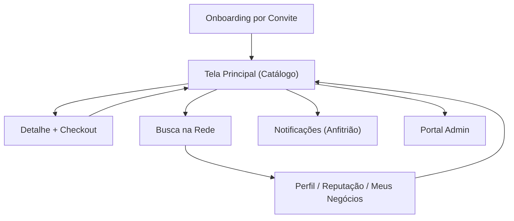

## 1. Product Overview

TROCASSATO é um marketplace com “KYC social” por convite, onde compradores e vendedores transacionam em Bitcoin (Sats) com foco em segurança e confiança por reputação.
O MVP roda em rede regtest (Bitcoin Core) e valida acesso via aprovação do anfitrião.

## 2. Core Features

### 2.1 User Roles

| Papel                 | Método de cadastro                               | Permissões principais                                                       |
| --------------------- | ------------------------------------------------ | --------------------------------------------------------------------------- |
| Convidado (⭐)         | Link de convite + cadastro                       | Navegar catálogo (read-only), ver detalhes; comprar bloqueado até aprovação |
| Usuário Aprovado (⭐+) | Aprovação do anfitrião                           | Comprar/pagar, ver histórico e reputação                                    |
| Vendedor (⭐⭐)         | Evolução de nível (conforme regras de reputação) | Cadastrar negócios/itens e gerenciar “Meus negócios”                        |
| Anfitrião             | Usuário com convidados                           | Aprovar/recusar convidados (módulo “sininho”)                               |
| Admin                 | Conta administrativa                             | Monitorar árvore de convites e suspender usuários quando necessário         |

### 2.2 Feature Module

Nosso MVP é composto pelas seguintes páginas principais:
0\. **Login (Usuário)**: acesso com e-mail + senha.

1. **Onboarding por Convite**: cadastro (nome, e-mail, CPF, foto), status “aguardando aprovação”.
2. **Tela Principal (Catálogo)**: grid de cards de negócios; estado read-only para ⭐.
3. **Detalhe + Checkout**: detalhe do item, resumo de pagamento, confirmação segura (segurar/slider) e processamento.
4. **Busca na Rede**: busca por vendedores, exibição do “convidado por…”, acesso ao perfil do vendedor.
5. **Perfil / Reputação / Meus Negócios**: badge/estrelas, barra de progresso, histórico de transações; cadastro de negócio (para vendedor).
6. **Notificações (Sininho) do Anfitrião**: lista de solicitações de entrada com aprovar/recusar.
7. **Login (Admin)**: acesso ao portal administrativo com usuário e senha.
8. **Portal Admin**: árvore/grafo de convites, filtros de transações e alertas, suspensão preventiva.

### 2.3 Page Details

| Page Name                          | Module Name                           | Feature description                                                                                                                                                                         |
| ---------------------------------- | ------------------------------------- | ------------------------------------------------------------------------------------------------------------------------------------------------------------------------------------------- |
| Login (Usuário)                    | Autenticação                          | Entrar com e-mail e senha; manter sessão ativa; negar acesso às rotas protegidas quando não autenticado.                                                                                    |
| Onboarding por Convite             | Formulário de cadastro                | Coletar nome, e-mail (único), CPF (11 dígitos, único, sem dígito), foto (URL) opcional; gerar “ID Carteira” (CPF+primeiro+último); enviar e exibir status “aguardando aprovação do anfitrião”. |
| Onboarding por Convite             | Definição de senha                    | Definir senha (mín. 8 caracteres) e confirmação; armazenar somente hash; nunca armazenar senha em texto puro.                                                                               |
| Onboarding por Convite             | Provisionamento de carteira (regtest) | Criar wallet no Bitcoin Core via RPC (`createwallet`) e só concluir cadastro após confirmação; inicializar wallet com 1 BTC para fins de MVP.                                               |
| Tela Principal (Catálogo)          | Estado de espera (⭐)                  | Exibir banner fixo “Seu acesso está sendo validado…”; permitir abrir detalhe, mas manter ação de compra desabilitada com cadeado.                                                           |
| Tela Principal (Catálogo)          | Lista de negócios                     | Listar cards com imagem, título e valor; manter consistência com limites de 50/200 caracteres.                                                                                              |
| Detalhe + Checkout                 | Resumo e confirmação                  | Mostrar vendedor, “convidado por…”, valor em Sats e aviso legal; exigir confirmação segura (segurar/slider).                                                                                |
| Detalhe + Checkout                 | Processamento on-chain                | Enviar transação via RPC e aguardar confirmação via ZMQ; ao confirmar, persistir no banco e notificar sucesso ao usuário.                                                                   |
| Busca na Rede                      | Busca e resultados                    | Buscar vendedores; exibir foto, nome, estrelas e badge “Convidado por \[X]”; navegar para perfil do vendedor com itens.                                                                     |
| Perfil / Reputação / Meus Negócios | Dashboard de reputação                | Exibir badge de nível, barra de progresso para próximo nível e histórico (data, valor, status, avaliação); atualizar badge automaticamente ao cumprir critérios.                            |
| Perfil / Reputação / Meus Negócios | Cadastro de negócio (vendedor)        | Criar item com título (<=50), descrição (<=200), valor em BRL; calcular e exibir “Valor em Sats” em tempo real; publicar negócio.                                                           |
| Notificações (Anfitrião)           | Aprovação de convidados               | Listar solicitações (foto, nome, “quer entrar na rede”); aprovar/recusar; remover card após ação com feedback visual.                                                                       |
| Login (Admin)                      | Autenticação                          | Entrar com usuário e senha do admin; credencial inicial definida na instalação (via `.env`); bloquear acesso ao portal sem login.                                                           |
| Portal Admin                       | Monitoramento e mitigação             | Filtrar por status; visualizar grafo de convites (anfitriões x convidados), alertas de anomalia/denúncia; pesquisar UID e suspender usuário/anfitrião.                                      |

## 3. Core Process

**Fluxo do Convidado (⭐)**: você acessa o link de convite → preenche cadastro (inclui senha) → o sistema provisiona sua carteira regtest → você faz login → você vê catálogo em modo espera → aguarda aprovação.

**Fluxo do Anfitrião**: você abre Notificações → revisa solicitações → aprova/recusa → ao aprovar, o convidado passa a poder comprar.

**Fluxo do Comprador**: você navega catálogo → abre detalhe → confirma checkout (segurar/slider) → acompanha processamento → ao confirmar na blockchain, recebe confirmação e o evento é registrado.

**Fluxo do Vendedor**: você acessa “Meus negócios” → cadastra item (BRL) → visualiza conversão para Sats em tempo real → publica.

**Fluxo Admin**: você acessa portal → pesquisa usuário/UID → visualiza árvore de convites → identifica origem e aplica suspensão preventiva.

**Autenticação (MVP)**

* Usuário: login com `e-mail + senha`.

* Admin: login com `usuário + senha` (usuário padrão `admin` e senha definida na instalação).

* Segurança: armazenar **apenas hash de senha**; sessão via token/cookie; bloquear rotas quando não autenticado.

